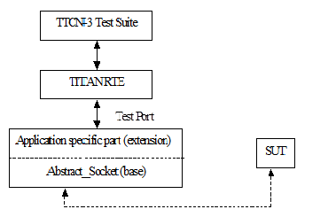

= Abstract Socket Test Port for TTCN-3 Toolset with TITAN, Description
:author: Gábor Szalai
:revnumber: 1551-CNL 113 384, Rev. A
:revdate: 2015-01-20
:toc:

== About This Document

=== How to Read This Document

This is the User Guide for the Abstract Socket test port. The Abstract Socket test port is developed for the TTCN-3 Toolset.

=== Presumed Knowledge

To use this protocol module the knowledge of the TTCN-3 language <<_1, [1]>> is essential.

= Functionality

== System Requirements
In order to use the Abstract Socket test port the following system requirements must be satisfied:

* Platform: any platform supported by TITAN RTE and OpenSSL
* TITAN TTCN-3 Test Executor version R8A (1.8.pl0) or higher installed.

NOTE: This Abstract Socket version is not compatible with TITAN releases earlier than R8A.

If SSL is used, the same OpenSSL must be installed as used in TITAN. For an OpenSSL installation guide see <<_3, [3]>>.

== Fundamental Concepts

The test port establishes connection between the TTCN-3 test executor and SUT and transmits/receives messages. The transport channel can be TCP or SSL. The connect and listen operations can be initiated from the test suite using the `use_connection_ASPs` test port parameter.

=== Module Structure

The Abstract Socket common component is implemented in the following files:

* __Abstract_Socket.hh__
* __Abstract_Socket.cc__

== Start Procedure

=== Connection ASPs

When choosing to use connection ASPs, the Abstract Socket is able to open a server listening port (acting like a server) or client connections at the same time.

=== Server Mode

When the test port is mapped by TITAN RTE, the server creates a TCP socket and starts listening on it. Depending on the transport channel specified in the runtime configuration file, it will accept either TCP or SSL connections.

=== Client Mode

When the test port is mapped by TITAN RTE, the client creates a TCP socket and tries to connect to the server. If the transport channel is SSL, the client starts an SSL handshake after the TCP connection is established. If the SSL handshake is successful, the SSL connection is established and the `map` operation is finished.

The SSL handshake may fail due to several reasons (e.g. no shared ciphers, verification failure, etc.).

[[sending-receiving-messages]]
== Sending/Receiving Messages

Only basic octetstring sending and receiving is handled by the Abstract Socket. This functionality probably must be extended in order to build a test port for the desired protocol. First the TTCN-3 mapping of the target protocol messages must be elaborated and then the message processing functions can be developed.

== Logging

The type of information that will be logged can be categorized into two groups. The first one consists of information that shows the flow of the internal execution of the test port, e.g. important events, which function that is currently executing etc. The second group deals with presenting valuable data, e.g. presenting the content of a PDU. The logging printouts will be directed to the RTE log file. The user is able to decide whether logging is to take place or not by setting appropriate configuration data.

== Error Handling

Erroneous behavior detected during runtime is directed into the RTE log file. The following two types of messages are taken care of:

* Errors: information about errors detected is provided. If an error occurs the execution of the test case will stop immediately. The test ports will be unmapped.
* Warnings: information about warnings detected is provided. The execution continues after the warning is shown.

== Closing Down

The connection can be shut down either performing the `unmap` operation on the port or if connection ASPs are used with the appropriate ASP.

== IPv6 Support

It is possible to select the address family used for server socket and client connections in the configuration file or during runtime. The following address families are supported: IPv4, IPv6 and UNSPEC.

== SSL Functionality

The Abstract Socket can use SSL or TCP as the transport channel. The same version of OpenSSL library must be used as in TITAN.

The supported SSL/TLS versions are determined by the used OpenSSL library. It is possible to disable a specific TLS/SSL version in the run time configuration file.

=== Compilation

The usage of SSL and even the compilation of the SSL related code parts are optional. This is because SSL related code parts cannot be compiled without the OpenSSL installed.

The compilation of SSL related code parts can be disabled by not defining the `AS_USE_SSL` macro in the _Makefile_ during the compilation. If the macro is defined in the _Makefile_, the SSL code parts are compiled to the executable test code. The usage of the SSL then can be enabled/disabled in the runtime configuration file. Naturally, the test port parameter will be ignored if the `AS_USE_SSL` macro is not defined during compilation.

=== Authentication

The Abstract Socket provides both server side and client side authentication. When authenticating the other side, a certificate is requested and the own trusted certificate authorities’ list is sent. The received certificate is verified whether it is a valid certificate or not (the public and private keys are matching). No further authentication is performed (e.g. whether hostname is present in the certificate). The verification can be enabled/disabled in the runtime configuration file.

In server mode the test port will always send its certificate and trusted certificate authorities’ list to its clients. If verification is enabled in the runtime configuration file, the server will request for a client’s certificate. In this case, if the client does not send a valid certificate or does not send a certificate at all, the connection will be refused. If the verification is disabled, the connection will never be refused due to verification failure.

In client mode the test port will send its certificate to the server on the server’s request. If verification is enabled in the runtime configuration file, the client will send its own trusted certificate authorities’ list to the server and will verify the server’s certificate as well. If the server’s certificate is not valid, the SSL connection will not be established. If verification is disabled, the connection will never be refused due to verification failure.

The own certificate(s), the own private key file, the optional password protecting the own private key file and the trusted certificate authorities’ list file can be specified in the runtime configuration file.

The test port will check the consistency between its own private key and the public key (based on the own certificate) automatically. If the check fails, a warning is issued and execution continues.

=== Other Features

The usage of SSL session resumption can be enabled/disabled in the runtime configuration file.

The allowed ciphering suites can be restricted in the runtime configuration file, see.

The SSL re-handshaking requests are accepted and processed, however re-handshaking cannot be initiated from the test port.

=== Limitations

* SSL re-handshaking cannot be initiated from the test port.
* The own certificate file(s), the own private key file and the trusted certificate authorities’ list file must be in PEM format. Other formats are not supported.

= The Test Port

== Overview

The Abstract Socket is a common component that can serve as a basis for test ports that need TCP connections with or without SSL on the top. The TCP socket can be used either with blocking or non-blocking socket. The Abstract Socket implements basic sending, receiving and socket handling routines, furthermore it supports the development of test ports that can work as a client or as a server. By extending the Abstract Socket component with additional functionality the desired test port can be built.

See the functioning of the Abstract Socket below:

== Installation

Since the Abstract Socket test port is used as a part of the TTCN-3 test environment this requires TTCN-3 Test Executor to be installed before any operation of the Abstract Socket test port.

The compilation of SSL related code parts can be disabled by not defining the `AS_USE_SSL` macro in the _Makefile_ during the compilation.

When building the executable test suite the libraries compiled for the OpenSSL toolkit (if the `AS_USE_SSL` macro is defined) should also be linked into the executable along with the TTCN-3 Test Executor, i.e. the OpenSSL libraries should be added to the __Makefile__ generated by the TITAN executor (see example in section <<warning_messages_in_case_SSL_connections_are_used, Warning Messages in case SSL Connections Are Used>>). To compile the source files you will also need the OpenSSL developer toolkit which contains the header files used by the source. If Share Objects (_.so_) are used in the OpenSSL toolkit, to run the executable, the path of the OpenSSL libraries must be added to the `LD_LIBRARY_PATH` environment variable.

NOTE: If you are using the test port on Solaris, you have to set the `PLATFORM` macro to the proper value. It shall be `_SOLARIS_` in case of Solaris 6 (SunOS 5.6) and `_SOLARIS8_` in case of Solaris 8 (SunOS 5.8).

== Configuration

The executable test program behavior is determined via the run-time configuration file. This is a simple text file, which contains various sections (for example, `[TESTPORT_PARAMETERS]`) after each other. The usual suffix of configuration files is _.cfg._ For further information on the configuration file see <<_2, [2]>>.

The listed port parameters (<<Abstract_Socket_Test_Port_Parameters_in_the_Test_Port_Configuration_File, Abstract Socket Test Port Parameters in the Test Port Configuration File>>) are managed by default by the Abstract Socket. They have to be defined only in the TTCN configuration files. Though, if Abstract Socket's parameter handling is not appropriate for your application, you can ignore it completely and handle the variables directly from your port. It is recommended to implement your own test port parameter name passing functions so that your test port will not depend on the test port parameter names in the Abstract Socket.

[[Abstract_Socket_Test_Port_Parameters_in_the_Test_Port_Configuration_File]]
=== Abstract Socket Test Port Parameters in the Test Port Configuration File

In the `[TESTPORT_PARAMETERS]` section the following parameters can be set for the Abstract Socket based test port. The parameter names are case-sensitive; the parameter values are not case-sensitive (i.e. `_"YES"_`, `_"yes"_`, `_"Yes"_` values are identical).

[[abstract-socket-test-port-parameters-in-the-test-port-configuration-file-if-the-transport-channel-is-tcp-ip]]
==== Abstract Socket Test Port Parameters in the Test Port Configuration File if the Transport Channel is TCP/IP

* `use_connection_ASPs`
+
The parameter is optional, and can be used to specify whether the Abstract Socket is controlled by connection ASPs. The default value is `_"no"_`.
+
If the value is `_"yes"_`, the functionalities of the Abstract Socket have to be controlled by calling its `open_client_connection`, `open_listen_port`, `remove_client`, `remove_all_clients` and `close_listen_port` functions. The Abstract Socket will not create any connection or listening port when calling the `map_user` function. Using this parameter, more than one connection can be opened in client mode operation. The Abstract Socket will call the `listen_port_opened`, `client_connection_opened`, `peer_connected` and `peer_disconnected` functions of the test port implementing it when corresponding events happen. This allows test ports and TTCN code to directly handle TCP connection initiations and events.

* `server_mode`
+
The parameter is optional, and can be used to specify whether the test port shall act as a server or a client. If the value is `_"yes"_`, the test port will act as a server. If the value is `_"no"_`, the test port will act as a client. The default value is `_"no"_` . The parameter has no meaning if `use_connection_ASPs` is set to `_"yes"_` because the `open_listen_port` initiates the listening on a server port.

* `socket_debugging`
+
The parameter is optional, and can be used to enable debug logging related to the transport channel (TCP socket and SSL operations) in the test port. The default value is `_"no"_`.

* `halt_on_connection_reset`
+
The parameter is optional, and can be used to specify whether the test port shall stop on errors occurred during connection setup (including connection refusing), sending and receiving, disconnection (including the detection of the disconnection). The value `_"yes"_` means the test port will stop, the value `_"no"_` means that it will not stop on such errors. The default value is `_"no"_` in server mode and `_"yes"_` in client mode.
+
The parameter has no meaning if `use_connection_ASPs` is set to `_"yes"_`, because the `peer_disconnected` function of the test port is called on the event.

* `nagling`
+
The parameter is optional, and can be used to specify whether concatenation occurs on TCP layer. If value is `_"yes"_`, concatenation is enabled. If value is `_"no"_`, it is disabled.
+
NOTE: The `nagling` setting is valid only for the outgoing messages. The `nagling` for the incoming messages shall be set by the sending party. The default value is `_"no"_`.

* `remote_address`
+
The parameter can be used to specify the server's IP address. Mandatory in client mode and not used in server mode.
+
The parameter has no meaning if `use_connection_ASPs` is set to `_"yes"_`, because the `open_client_connection` function receives the remote and optionally the local address.

* `remote_port`
+
The parameter can be used to specify the server's listening port. Mandatory in client mode and not used in server mode.
+
The parameter has no meaning if `use_connection_ASPs` is set to `_"yes"_`, because the `open_client_connection` function receives the remote and optionally the local address.

* `local_port`
+
The parameter can be used to specify the port where the server is listening for connections. Mandatory in server mode and optional in client mode.
+
The parameter serves as a default if `use_connection_ASPs` is set to `_"yes"_`.

* `ai_family`
+
The parameter can be used to specify the address family to use when opening listening ports or creating client connections. If its value is set to `_"IPv4"_` or `_"AF_INET"_` only IPv4 addresses are used. If it is set to `_"IPv6"_` or `_"AF_INET6"_` only IPv6 connections are allowed. The values `_`"UNSPEC"`_` and `"AF_UNSPEC"` can be used if the address family is not specified. The `_"UNSPEC"_` value allows using IPv4 and IPv6 addresses at the same time. The selection is made automatically depending on the actual value of the local and remote addresses.
+
This parameter is optional. The default value is `_"AF_UNSPEC"_`.

* `server_backlog`
+
The parameter can be used to specify the number of allowed pending (queued) connection requests on the port the server listens. It is optional in server mode and not used in client mode. The default value is `_"1"_`.

* `TCP_reconnect_attempts`
+
This parameter can be used to specify the maximum number of times the connection is attempted to be established in TCP reconnect mode. The default value is `_"5"_`.
+
The parameter has no meaning if `use_connection_ASPs` is set to `_"yes"_`, because the `peer_disconnected` function is called when the event happens, and it’s up to the test port or TTCN code how to continue.

* `TCP_reconnect_delay`
+
This parameter can be used to specify the time (in seconds) the test port waits between to TCP reconnection attempt. The default value is `_"1"_`.
+
The parameter has no meaning if `use_connection_ASPs` is set to `_"yes"_`, because the `peer_disconnected` function is called when the event happens, and it’s up to the test port or TTCN code how to continue.

* `client_TCP_reconnect`
+
If the test port is in client mode and the connection was interrupted by the other side, it tries to reconnect again. The default value is ``no''.
+
The parameter has no meaning if `use_connection_ASPs` is set to `_"yes"_`, because the `peer_disconnected` function is called when the event happens, and it’s up to the test port or TTCN code how to continue.

* `use_non_blocking_socket`
+
This parameter can be used to specify whether the Test Port shall use blocking or non-blocking TCP socket. Using this parameter, the `send` TTCN-3 operation will block until the data is sent, but an algorithm is implemented to avoid TCP deadlock.
+
The parameter is optional, the default value is `_"no"_`.

==== Additional Abstract Socket Test Port Parameters in the Test Port Configuration File if the Transport Channel is SSL

These parameters available only if `AS_USE_SSL` macro is defined during compilation.

* `ssl_use_ssl`
+
The parameter is optional, and can be used to specify whether to use SSL on the top of the TCP connection or not. The default value is `_"no"_`.

* `ssl_verify_certificate`
+
The parameter is optional, and can be used to tell the test port whether to check the certificate of the other side. If it is defined `_"yes"_`, the test port will query and check the certificate. If the certificate is not valid (i.e. the public and private keys do not match), it will exit with a corresponding error message. If it is defined `_"no"_`, the test port will not check the validity of the certificate. The default value is `_"no"_`.

* `ssl_use_session_resumption`
+
The parameter is optional, and can be used to specify whether to use/support SSL session resumptions or not. The default value is `_"yes"_`.

* `ssl_certificate_chain_file`
+
It specifies a PEM encoded file’s path on the file system containing the certificate chain. Mandatory in server mode and optional in client mode. Note that the server may require client authentication. In this case no connection can be established without a client certificate.

* `ssl_private_key_file`
+
It specifies a PEM encoded file’s path on the file system containing the server’s RSA private key. Mandatory in server mode and optional in client mode.

* `ssl_private_key_password`
+
The parameter is optional, and can be used to specify the password protecting the private key file. If not defined, the SSL toolkit will ask for it.

* `ssl_trustedCAlist_file`
+
It specifies a PEM encoded file’s path on the file system containing the certificates of the trusted CA authorities to use. Mandatory in server mode, and mandatory in client mode if `ssl_verify_certificate="yes"`.

* `ssl_allowed_ciphers_list`
+
The parameter is optional, and can be used to specify the allowed cipher list. The value is passed directly to the SSL toolkit.

* `ssl_disable_SSLv2` +
`ssl_disable_SSLv3` +
`ssl_disable_TLSv1` +
`ssl_disable_TLSv1_1` +
`ssl_disable_TLSv1_2`
+
The usage of a specific SSL/TLS version can be disabled by setting the parameter to `_"yes"_`. Please note that the available SSL/TLS versions are depends of the used OpenSSL library.

== The `AbstractSocket` API

In the derived test port the following functions can be used:

[[map-unmap-the-test-port]]
=== Map/Unmap the Test Port

In the `user_map` and `user_unmap` functions of the derived test port these functions should be called:

[source]
----
void map_user();

void unmap_user();
----

=== Setting Test Port Parameters

[source]
----
bool parameter_set(const char __parameter_name, const char __parameter_value);
----

Call this function in the `set_parameter` function of the derived test port to set the test port parameters of AbstractSocket.

=== Open a Listening Port

To open a server socket call the following function:

[source]
----
int open_listen_port(const char* localHostname, const char* localService);
----

This function supports both IPv4 and IPv6 addresses. The parameter `localHostname` should specify the local hostname. It can be the name of the host or an IP address. The parameter `localService` should be a string containing the port number. One of the two parameters can be `_NULL_`, meaning `_ANY_` for that parameter. The address family used is specified either by the `ai_family_name()` testport parameter or set by the function `set_ai_family(int)`.

The following function only supports IPv4:

`int open_listen_port(const struct sockaddr_in & localAddr);`

NOTE: This function is deprecated. It is kept for compatibility with previous versions of test ports that use `AbstractSocket`

After calling the `open_listen_port` function, the function virtual void `listen_port_opened(int port_number)` is called automatically with the listening port number, or `_-1_` if the opening of the listening port failed. This function can be overridden in the derived test port to implement specific behavior depending on the listen result. This can, for example, call `incoming_message` to generate an incoming `ListenResult` message in the test port.

Subsequent calls of the function `open_listen_port` results in closing the previous listening port and opening a new one. This means that only one server port is supported by `AbstractSocket`.

When a client connects to the listening port the following functions are called to notify the derived test port about the new client connection:

[source]
----
virtual void peer_connected(int client_id, const char * host, const int port)
virtual void peer_connected(int client_id, sockaddr_in& remote_addr);
----

Only one of these functions should be overridden in the derived test port. Note, that the second is obsolete. It is kept for backward compatibility only.

Similar functions for client disconnects:

[source]
----
virtual void peer_disconnected(int client_id);
virtual void peer_half_closed(int client_id);
----

The `client_id` parameter specifies which client has disconnected/half closed. The `peer_half_closed` function is called when the client closes the socket for writing, while `peer_disconnected` is called when the client is disconnected. Both functions can be overridden in the derived test port.

=== Close the Listening Port

`void close_listen_port()`

This function closes the listening port.

=== Open a Client Connection

[source]
----
int open_client_connection(const char* remoteHostname, const char* remoteService, const char* localHostname, const char* localService);
----

This function creates an IPv4 or IPv6 connection from the local address `localHostname/localService` to the remote address `remoteHostname/remoteService`.

If `localHostname` or `localService` is `_NULL_`, it will be assigned automatically.

The parameters for the remote address cannot be `_NULL_`. The local or remote service parameters should be numbers in string format, while the addresses should be names or IP addresses in IPv4 or IPv6 format.

The `open_client_connection` function above makes the following function obsolete:

[source]
----
int open_client_connection(const struct sockaddr_in & new_remote_addr, const struct sockaddr_in & new_local_addr)
----

It is kept for backward compatibility for derived test ports that were not adapted to the IPv6 supporting function.

After calling the `open_client_connection` function, AbstractSocket calls automatically the function `virtual void client_connection_opened(int client_id)` to inform the test port about the result. The `client_id` parameter is set to the id of the client, or `_-1_` if the connection could not be established to the remote address. This function can be overridden in the derived test port.

=== Send Message

[source]

void send_outgoing(const unsigned char* message_buffer, int length, int client_id = -1);

With this function a message can be sent to the specified client.

==== To Receive a Message

When a message is received, the following function is called automatically:

[source]
----
virtual void message_incoming(const unsigned char* message_buffer, int length, int client_id = -1)
----

This function must be overridden in the derived test port. To generate an incoming TTCN3 message, the test port shall call the `incoming_message` function of the Titan API within this function.

In order that this function could be called automatically, the derived test port shall define these functions:

[source]
----
virtual void Handler_Install(const fd_set* read_fds, const fd_set* write_fds, const fd_set* error_fds, double call_interval);
virtual void Handler_Uninstall();
----

In `Handler_Install` the `Install_Handler` Titan API function is called.

Also in the `Event_Handler` Titan API function, the function

[source]
----
void Handle_Event(const fd_set *read_fds, const fd_set __write_fds, const fd_set __error_fds, double time_since_last_call)
----
is called.

=== Close a Client Connection

[source]
----
virtual void remove_client(int client_id);
virtual void remove_all_clients();
----

The first closes the connection for a given client the second function closes the connection of all clients.

=== Test Port Parameter Names

The default AbstractSocket test port parameter names can be redefined in the derived test port by overriding the appropriate function below:

[source]
----
virtual const char* local_port_name();
virtual const char* remote_address_name();
virtual const char* local_address_name();
virtual const char* remote_port_name();
virtual const char* ai_family_name();
virtual const char* use_connection_ASPs_name();
virtual const char* halt_on_connection_reset_name();
virtual const char* client_TCP_reconnect_name();
virtual const char* TCP_reconnect_attempts_name();
virtual const char* TCP_reconnect_delay_name();
virtual const char* server_mode_name();
virtual const char* socket_debugging_name();
virtual const char* nagling_name();
virtual const char* use_non_blocking_socket_name();
virtual const char* server_backlog_name();
virtual const char* ssl_disable_SSLv2();
virtual const char* ssl_disable_SSLv3();
virtual const char* ssl_disable_TLSv1();
virtual const char* ssl_disable_TLSv1_1();
virtual const char* ssl_disable_TLSv1_2();
----

=== Parameter Accessor Functions

The following functions can be use to get/set the AbstractSocket parameters:

[source]
----
bool get_nagling() const
bool get_use_non_blocking_socket() const
bool get_server_mode() const
bool get_socket_debugging() const
bool get_halt_on_connection_reset() const
bool get_use_connection_ASPs() const
bool get_handle_half_close() const
int set_non_block_mode(int fd, bool enable_nonblock);
bool increase_send_buffer(int fd, int &old_size, int& new_size);
const char* get_local_host_name()
const unsigned int get_local_port_number()
const char* get_remote_host_name()
const unsigned int get_remote_port_number()
const int& get_ai_family() const
void set_ai_family(int parameter_value)
bool get_ttcn_buffer_usercontrol() const
void set_nagling(bool parameter_value)
void set_server_mode(bool parameter_value)
void set_handle_half_close(bool parameter_value)
void set_socket_debugging(bool parameter_value)
void set_halt_on_connection_reset(bool parameter_value)
void set_ttcn_buffer_usercontrol(bool parameter_value)
----

=== Logging Functions

The following functions log a given message in different ways:

[source]
----
void log_debug(const char *fmt, …) const
void log_warning(const char *fmt, …) const
void log_error(const char *fmt, …) const
void log_hex(const char __prompt, const unsigned char __msg, size_t length) const;
----

=== Error Reporting

[source]
----
virtual void report_error(int client_id, int msg_length, int sent_length, const unsigned char* msg, const char* error_text);
----

This function is called automatically if an error occurs during send operation in `AbstractSocket`. This function can be overridden in the derived test port to override the default error reporting behavior of `AbstractSocket`, which is calling the `log_error` function. This function can also be called by the derived test port to initiate the error reporting mechanism.

= Tips and Tricks

== Usage

In order to build a test port based on `Abstract_Socket` the following steps must be completed:

1.  Deriving the test port class (see <<deriving_the_test_port_class, Deriving the Test Port Class>>)
2.  Implementation of the logger functions if needed (see <<implementation_of_the_logger_functions, Implementation of the Logger Functions>>)
3.  Function translations (see <<function_translations, Function Translations>>)
4.  Installing the handlers (see <<functions_for_manipulating_the_set_of_events_for_which_the_port_waits, Functions for Manipulating the Set of Events for Which the Port Waits>>)
5.  Final steps (see <<final_steps, Final Steps>>)

These steps are discussed in detail in the following subsections.

[[deriving_the_test_port_class]]
=== Deriving the Test Port Class

Inherit your test port class beside the test port base also from the `Abstract_Socket` class, if you do not want to use SSL at all. If you plan to use SSL, inherit the test port from the `SSL_Socket` class. In case your SSL implementation is just optional, you have to make sure that it is possible to disable SSL related code parts at compile time. In the AS if the `AS_USE_SSL` macro is defined, then SSL is enabled, otherwise disabled.

Example:

[source]
----
#ifdef AS_USE_SSL
class myport__PT : public SSL_Socket, public myport__PT_BASE {
#else
class myport__PT : public Abstract_Socket, public myport__PT_BASE {
#endif
----

[[implementation_of_the_logger_functions]]
=== Implementation of the Logger Functions

Implement the `log_debug`, `log_error`, `log_warning` and `log_hex` virtual functions if you need other implementation than the default. (they can be empty implementations if logging is not needed)

[width="100%",cols="20%,80%",options="header",]
|===============================================================
|Function |Description
|`log_debug` |does the debug-logging
|`log_hex` |does the logging of the message content in hex format
|`log_warning` |does the logging of warning messages
|`log_error` |is expecting the test port to stop with a TTCN_ERROR
|===============================================================

You can use the logger functions implemented in the AS. In this case you have to call the AS constructor with your test port type and name. In this way the AS will log messages acting like your test port.

[[function_translations]]
=== Function Translations

Translate the port's functions to the socket's functions. By translating we mean a function call with unchanged parameters like this:

[source]
----
void myport__PT::set_parameter(const char *parameter_name,
  const char* parameter_value) {
    parameter_set(parameter_name ,parameter_value);
}
----

The list of functions to be translated:

[cols=",",options="header",]
|====================================
|Port functions: |Socket functions:
|`set_parameter` |`parameter_set`
|`Handle_Fd_Event` |`Handle_Socket_Event`
|`Handle_Timeout` |`Handle_Timeout_Event`
|`user_map` |`map_user`
|`user_unmap` |`unmap_user`
|====================================

If you might need other functions also to be performed during `map`, `unmap` or `set_parameter`, you can add them right after the socket's function calls.

Example:

[source]
----
void myport__PT::set_parameter(const char *parameter_name,
	     const char *parameter_value)
   {
       parameter_set(parameter_name ,parameter_value);
       if(strcmp(parameter_name,"dallas_addr") == 0){
      		destHostId = getHostId(parameter_value);
      		destAddr.sin_family = AF_INET;
      		destAddr.sin_addr.s_addr = htonl(destHostId);
      		return;
    	}
   }
----

The translation of the `outgoing_send` to `send_outgoing` function needs some parameter formatting since the `outgoing_send` has parameters inherited from your TTCN-3 structures, while `Abstract_Socket`'s `outgoing_send` has parameters as ``(char* message, int messageLength, int client_id)``.

The same applies for the incoming function calls where you have to write your own `message_incoming` to `incoming_message` translation.

Example:

[source]
----
void myport__PT::outgoing_send(const TTCN3__Structure& send_par)
{
  if(send_par.client__id().ispresent()) {
    send_outgoing((char*)(const unsigned char*)send_par.data(),
	    send_par.data().lengthof(), send_par.client__id()());
  } else {
    send_outgoing((char*)(const unsigned char*)send_par.data(),
	    send_par.data().lengthof());
  }
}
----

[[functions_for_manipulating_the_set_of_events_for_which_the_port_waits]]
=== Functions for Manipulating the Set of Events for Which the Port Waits

Add the following (virtual) member functions to your port (class definition) unchanged:

[source]
----
void Add_Fd_Read_Handler(int fd) { Handler_Add_Fd_Read(fd); }
void Add_Fd_Write_Handler(int fd) { Handler_Add_Fd_Write(fd); }
void Remove_Fd_Read_Handler(int fd) { Handler_Remove_Fd_Read(fd); }
void Remove_Fd_Write_Handler(int fd) { Handler_Remove_Fd_Write(fd); }
void Remove_Fd_All_Handlers(int fd) { Handler_Remove_Fd(fd); }
void Handler_Uninstall() { Uninstall_Handler(); }
void Timer_Set_Handler(double call_interval, boolean is_timeout = TRUE,
  boolean call_anyway = TRUE, boolean is_periodic = TRUE) {
  Handler_Set_Timer(call_interval, is_timeout, call_anyway, is_periodic);
}
----

NOTE: These member functions are required and used by Abstract Socket. They are defined in Abstract Socket as virtual and are to be overridden in the descendant Test Port class. They are implemented in the (Test Port) class definition only for the sake of simplicity.)

[[final_steps]]
=== Final Steps

Finally, the function definitions must be added to the header file accordingly. Then, you are ready to go ahead and develop your test port.

[[using-ttcn-buffer-in-test-ports]]
== Using `TTCN_Buffer` in Test Ports

The Abstract Socket uses a `TTCN_Buffer` <<_2, [2]>> to store incoming message portions. If the test port also would like to store incoming messages, here is a description how to do that:

The test port can access the `TTCN_Buffer` with `get_buffer`() and can operate on it. If the test port uses the buffer to store data, it must set the `ttcn_buffer_usercontrol` variable to `_true_`, so that the AS will not clear the buffer content.

In this case the test port can use the buffer in the following ways:

* `get_buffer`() to fetch the `TTCN_Buffer` associated with the client
* Optionally modify content; or wait for complete TLV
* Once a message portion is sent to the TTCN-3 test suite, cut the sent message from the buffer because the AS will not do that. In case the test port simply passed the message to the test suite and uses no storage of it (e.g. TCP Test Port), it can leave `ttcn_buffer_usercontrol` in false (which is the default value) so that the AS will take care of buffer cleanups.

== Using SSL on Top of a TCP Connection

SSL can be used on top of the TCP connection. The authentication mode can be configured via a test port parameter.

=== Server Mode

In server mode, first a TCP socket is created. The server starts to listen on this port (upon the `user_map`() operation or in case of connection ASPs, calling the `open_listen_port`() operation). Once a TCP connect request is received, the TCP connection is set up. After this the SSL handshake begins. The SSL is mapped to the file descriptor of the TCP socket. The BIO, which is an I/O abstraction that hides many of the underlying I/O details from an application, is automatically created by OpenSSL inheriting the characteristics of the socket (non-blocking mode). The BIO is completely transparent. The server always sends its certificate to the client. If configured so, the server will request the certificate of the client and check if it is a valid certificate. If not, the SSL connection is refused. If configured not to verify the certificate, the server will not request it from the client and the SSL connection is accepted. If usage of the SSL session resumption is enabled and the client refers to a previous SSL session, the server will accept it, unless it is not found in the SSL context cache. Once the connection is negotiated, data can be sent/received. The SSL connection is shut down using an `unmap`() operation. The shutdown process does not follow the standard: the server simply shuts down and does not expect any acknowledgement from the client.

Clients connected to the server are distinguished with their file descriptor numbers. When a message is received, the file descriptor number is also passed, so the client can be identified.

=== Client Mode

In client mode, first a TCP connection is requested to the server (upon the `user_map`() operation or in case of connection ASPs, calling the `open_client_connection`() operation). Once it is accepted, the SSL endpoint is created. If configured so, the client tries to use the SSL session Id from the previous connection, if available (e.g. it is not the first connection). If no SSL session Id is available, or the server does not accept it, a full handshake is performed. If configured so, the certificate of the server is verified. If the verification fails, the SSL connection is interrupted by the client. If no verification required, the received certificate is still verified, however the result does not affect the connection even though it failed.

=== Authentication Flow

In summary, the authentication is done according to this flow:

* ssl handshake begins (new client tries to connect)
* `virtual int ssl_verify_certificates_at_handshake(int preverify_ok, X509_STORE_CTX *ssl_ctx)` is called. During this handshake you can perform additional authentication.
* If the connection is accepted, the SSL handshake is finished and SSL is established. Now the function virtual `bool ssl_verify_certificates`() is called where you may perform other authentication if you want.

`ssl_verify_certificates`() is a virtual function. It is called after the SSL connection is up. Test ports may use it to check other peer's certificate and do actions. If the return value is 0, then the SSL connection is closed. In case of client mode, the test port exits with an error (`*verification_error*`). In server mode the test port just removes client data, but keeps running.

== Adapting Derived Test Ports to Support IPv6

Derived test ports should be updated in the following way to support IPv4 and IPv6:

All calls of functions

[source]
----
const struct sockaddr_in & get_remote_addr()
const struct sockaddr_in & get_local_addr()
----

should be removed. They can be replaced by calling these functions:

[source]
----
virtual const char* local_port_name();
virtual const char* local_address_name();
virtual const char* remote_port_name();
virtual const char* remote_address_name();
----

The function `int open_listen_port(const struct sockaddr_in & localAddr);` does not support IPv6. The function below should be used instead:

`int open_listen_port(const char* localHostname, const char* localServicename);`

The same has to be done for the `open_client_connection` function. Replace any call of the function

[source]
int open_client_connection(const struct sockaddr_in & new_remote_addr, const struct sockaddr_in & new_local_addr)

with the function:

[source]
----
int open_client_connection(const char* remoteHostname, const char* remoteService, const char* localHostname, const char* localService);
----

If the following callback function is overridden in the derived test port:

[source]
----
virtual void peer_connected(int client_id, sockaddr_in& remote_addr);
----

it should be removed and the following function should be overridden instead:

[source]
----
virtual void peer_connected(int client_id, const char * host, const int port)
----

The following function should not be used:

`void get_host_id(const char* hostName, struct sockaddr_in *addr)`

The socket API function `getaddrinfo` should be used instead.

= Error Messages

== Error Messages In Case TCP Connections Are Used

`*Parameter value <value> not recognized for parameter <name>*`

The specified `<value>` in the runtime configuration file is not recognized for the parameter <name>.

`*Invalid input as TCP_reconnect_attempts counter given: <value>*`

The specified `<value>` in the runtime configuration file must be a positive whole number.

`*TCP_reconnect_attempts must be greater than 0, <value> is given*`

The specified `<value>` for `TCP_reconnect_attempts` in the runtime configuration file must be greater than `_0_`.

`*Invalid input as TCP_reconnect_delay given: <value>*`

The specified `<value>` for the `TCP_reconnect_delay` parameter in the runtime configuration file must be a whole number not less than `_0_`.

`*TCP_reconnect_delay must not be less than 0, <value> is given*`

The specified `<value>` for the `TCP_reconnect_delay` parameter in the runtime configuration file must be a whole number not less than `_0_`.

`*Invalid input as port number given: <value>*`

The specified `<value>` in the runtime configuration file is cannot be interpreted as a valid port number (e.g. string is given).

`*Port number must be between 0 and 65535, <value> is given*`

The specified `<value>` in the runtime configuration file is cannot be interpreted as a valid port number. Port numbers must be in the range 0..65535.

`*Invalid input as server backlog given: <value>*`

The specified `<value>` in the runtime configuration file is cannot be interpreted as a valid server backlog number (e.g. string is given).

`*Cannot accept connection at port*`

Connection could not be accepted on TCP socket.

`*Error when reading the received TCP PDU*`

System error occurred during reading from the TCP socket.

`*Cannot open socket*`

Creation of the listener socket failed.

`*Setsockopt failed*`

Setting of socket options failed.

`*Cannot bind to port*`

Binding of a socket to a port failed.

`*Cannot listen at port*`

Listen on the listener socket failed.

`*getsockname() system call failed on the server socket*`

The query of the listening port number failed.

`*AbstractSocket: getnameinfo: <error>*`

The `getnameinfo` function returned an error.

`*getaddrinfo: <errortext> for host <host> service <service>*`

The `getaddrinfo` function returned an error.

`*Malformed message: invalid length: <length>. The length should be at least <lenght>.*`

The message received contains invalid length information.

`*Already tried <value> times, giving up*`

The deadlock counter exceeds the hard coded limit when trying to connect to a server in client mode. When connecting on a socket, sometimes it is unsuccessful. The next try usually solves the problem and the connection will be successfully accepted. The test port retries to connect as a workaround. The number of tries however limited to avoid hanging the test port.

Different operating systems behave in a different way. This problem is rare on Solaris, Unix and Linux systems, but much more often on Cygwin.

`*Cannot connect to server*`

Connection to a server on TCP failed.

`*Connection was interrupted by the other side*`

The TCP or SSL connection was refused by the other peer, or broken.

`*Client Id not specified although not only 1 client exists*`

It should never show up.

`*There is no connection alive, use the `ASP_TCP_Connect' before sending anything.*`

An attempt was made by the test port to send data before setting up any connection. The `open_client_connection` function has to be called before sending any data.

`*Send system call failed: There is no client connected to the TCP server*`

A send operation is performed to a non-existing client.

`*Send system call failed: <value> bytes were sent instead of <value>*`

The send operation failed.

`*<name> is not defined in the configuration file*`

The test port parameter <name> is not defined in the runtime configuration file, although its presence is mandatory (or conditional and the condition is true).

`*The host name <name> is not valid in the configuration file*`

The host name specified in the configuration file could not be resolved.

`*Number of clients<>0 but cannot get first client, programming error*`

It should never show up.

`*Index <value> exceeds length of peer list*`

It should never show up.

`*Abstract_Socket::get_peer: Client <value> does not exist*`

It should never show up.

`*Invalid Client Id is given: <value>*`

It should never show up.

`*Peer <value> does not exist*`

It should never show up.

`*Set blocking mode failed.*`

Test port could not set socket option: `O_NONBLOCK`

== Additional Error Messages In Case SSL Connections Are Used

Apart from the previously mentioned error messages, the following messages are used in case SSL is used:

`*No SSL CTX found, SSL not initialized*`

It should never show up.

`*Creation of SSL object failed*`

Creation of the SSL object is failed.

`*Binding of SSL object to socket failed*`

The SSL object could not be bound to the TCP socket.

`*SSL error occurred*`

A general SSL error occurred. Check the test port logs to see previous error messages showing the real problem.

`*<name> is not defined in the configuration file although <value>=yes*`

[source]
<name>: ssl_trustedCAlist_file_name(), <value>: ssl_verifycertificate_name()

`*No SSL data available for client <value>*`

It should never show up.

`*Could not read from /dev/urandom*`

The read operation on the installed random device is failed.

`*Could not read from /dev/random*`

The read operation on the installed random device is failed.

`*Could not seed the Pseudo Random Number Generator with enough data*`

As no random devices found, a workaround is used to seed the SSL PRNG. The seeding failed.

`*SSL method creation failed*`

The creation of the SSL method object failed.

`*SSL context creation failed*`

The creation of the SSL context object failed.

`*Can't read certificate file*`

The specified certificate file could not be read.

`*Can't read key file*`

The specified private key file could not be read.

`*Can't read trustedCAlist file*`

The specified certificate of the trusted CAs file could not be read.

`*Cipher list restriction failed for <value>*`

The specified cipher restriction list could not be set.

`*Activation of SSL session resumption failed on server*`

The activation of the SSL session resumption on the server failed.

`*Unknown SSL error code <value>*`

It should never show up.

= Warning Messages

== Warning Messages In Case TCP Connections Are Used

`*Error when reading the received TCP PDU*`

The received TCP PDU cannot be read.

`*connect() returned error code EADDRINUSE. Perhaps this is a kernel bug. Trying to connect again.*`

When connecting on a socket, sometimes it is unsuccessful. The next try usually solves the problem and the connection will be successfully accepted. The test port retries to connect as a workaround. The number of tries however limited to avoid hanging the test port.

Different operating systems behave in a different way. This problem is rare on Solaris, Unix and Linux systems, but much more often on Cygwin.

`*Connect() returned error code <value>, trying to connect again (TCP reconnect mode)*`

When connecting on a socket, sometimes it is unsuccessful and the given error code was returned. The next try usually solves the problem and the connection will be successfully accepted. The test port retries to connect as a workaround.

`*TCP connection was interrupted by the other side, trying to reconnect again.*`

The TCP or SSL connection was refused by the other peer, or it was broken. The test port tries to reconnect again.

`*TCP reconnect successfully finished.*`

This warning message is given if the reconnection was successful.

`*Parameter <name> has no meaning if use_connection_ASPs is used.*`

There is no effect of setting this parameter when `use_connection_ASPs` is set to `_"yes"_`.

`*Abstract_Socket::remove_client: <value> is the server listening port, can not be removed!*`

The `client_id` given in the `remove_client` function is currently used as the server’s listening port, it can not be removed. To close the server listening port, use the `close_listen_port` function.

`*Client <value> has not been removed, programming error*`

It should never show up.

`*Sending data on file descriptor <value>.The sending operation would block execution. The size of the outgoing buffer was increased from <old_value> to <new_value> bytes.*`

When the Abstract Socket is used with non-blocking socket, if the sending operation would block, first the size of the sending buffer is increased. This is the first step to avoid TCP deadlock. In the second step the Test Port will try to receive some data.

`*Sending data on file descriptor <value>.The sending operation would block execution and it is not possible to further increase the size of the outgoing buffer. Trying to process incoming data to avoid deadlock.*`

When the Abstract Socket is used with non-blocking socket, if the sending operation would block, and the size of the outgoing buffer cannot be increased, the Test Port tries to receive some data to avoid deadlock.

`*System call fcntl(F_GETFL) failed on file descriptor %d.*`

`*System call fcntl(F_SETFL) failed on file descriptor %d.*`

`*Setsockopt failed when trying to open the listen port: <port>*`

The `setsockopt` function failed.

`*Cannot bind to port when trying to open the listen port: <port>*`

The bind system call failed.

`*Cannot listen at port when trying to open the listen port: <port>*`

The listen system call failed.

`*getsockname() system call failed on the server socket when trying to open the listen port: <port>*`

The getsockname system call failed.

`*getaddrinfo: <errortexr> for host <host> service <service>*`

The getaddrinfo system call failed.

`*getnameinfo() system call failed on the server socket when trying to open the listen port: <port>*`

The getnameinfo system call failed.

`*Cannot open socket when trying to open client connection: <errortext>*`

The socket system call failed.

`*Setsockopt failed when trying to open client connection: <errormessage>*`

The setsockopt system call failed.

`*Cannot bind to port when trying to open client connection: <errortext>*`

The bind system call failed.

`*Already tried <n> times, giving up when trying to open client connection: <errortext>*`

The deadlock counter exceeds the hard coded limit when trying to connect to a server in client mode. When connecting on a socket, sometimes it is unsuccessful. The next try usually solves the problem and the connection will be successfully accepted. The test port retries to connect as a workaround. The number of tries however limited to avoid hanging the test port.

Different operating systems behave in a different way. This problem is rare on Solaris, Unix and Linux systems, but much more often on Cygwin.

[[warning_messages_in_case_SSL_connections_are_used]]
== Warning Messages In Case SSL Connections Are Used

`*Warning: race condition while setting current client object pointer.*`

The current client object pointer is already set.

`*Connection from client <value> is refused*`

The connection from a client is refused in the server.

`*Connection to server is refused*`

The connection from the client is refused by the server.

`*Server did not send a session ID*`

The SSL server did not send a session ID.

`*Verification failed*`

The verification of the other side is failed. The connection will be shut down.

`*SSL object not found for client <value>*`

It should never show up.

`*SSL_Socket::receive_message_on_fd: SSL connection was interrupted by the other side*`

The TLS/SSL connection has been closed. If the protocol version is SSL 3.0 or TLS 1.0, this warning appears only if a closure alert has occurred in the protocol, i.e. if the connection has been closed cleanly. Note that in this case it does not necessarily indicate that the underlying transport has been closed.

`*Other side does not have certificate*`

The other side of the SSL connection does not have a certificate.

`*Solaris patches to provide random generation devices are not installed*`

Solaris patches to provide random generation devices are not installed. A workaround will be used to seed the PRNG.

`*Private key does not match the certificate public key*`

The private key specified for the test port does not match with the public key.

= Terminology

*Sockets:* +
The socket is a method for communication between a client program and a server program in a network. A socket is defined as "the endpoint in a connection". Sockets are created and used with a set of programming requests or "function calls" sometimes called the sockets application programming interface (API). The most common socket API is the Berkeley UNIX C language interface for sockets. Sockets can also be used for communication between processes within the same computer.

*Blocking and non-blocking sockets:* +
Using a blocking socket, some socket operations (send, receive, connect, accept) will block until the operation is finished or an error occurs. Using a non-blocking socket, these operations will never block but return with an error and set `errno` to the appropriate value.

*OpenSSL:* +
The OpenSSL Project is a collaborative effort to develop a robust, commercial-grade, full-featured, and open source toolkit implementing the Secure Sockets Layer (SSL v2/v3) and Transport Layer Security (TLS v1) protocols as well as a full-strength general purpose cryptography library. For more information on the OpenSSL project see <<_3, [3]>>

= Abbreviations

AS:: Abstract Socket

ASP:: Abstract Service Primitive

IPv4:: Internet Protocol version 4

IPv6:: Internet Protocol version 6

PEM:: Privacy Enhanced Mail

RTE:: Run-Time Environment

SSL:: Secure Sockets Layer

SUT:: System Under Test

TCP:: Transmission Control Protocol

TLS:: Transport Layer Security

TTCN-3:: Testing and Test Control Notation version 3

= References

[[_1]]
[1] ETSI ES 201 873-1 (2002) +
The Testing and Test Control Notation version 3. Part 1: Core Language

[[_2]]
[2] User Guide for TITAN TTCN–3 Test Executor

[[_3]]
[3] OpenSSL toolkit +
  http://www.openssl.org
